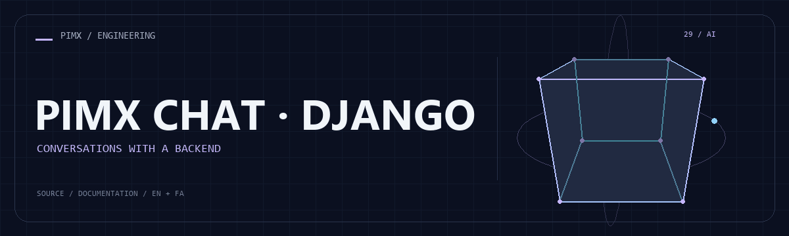

<div align="center">



**[English](README.md) · [فارسی](README.fa.md)**


</div>

# PIMX CHAT · DJANGO

برنامه گفتگو با Django، مدیریت حساب، ذخیره مکالمه، فایل استاتیک و اتصال پاسخ هوش مصنوعی.

[GitHub](https://github.com/MOHAMMADREZAABEDINPOOR/chat) · [PIMX / Profile](https://github.com/MOHAMMADREZAABEDINPOOR) · [بنر ثابت](assets/readme/hero.png)

## امکانات

- اپ‌های حساب و گفتگو در Django
- مدل مکالمه و رابط مبتنی بر قالب
- فایل استاتیک و وابستگی مرتبط با استقرار
- پکیج Google AI در فهرست وابستگی

## پشته فنی

| ابزار | نسخه یا منبع |
|---|---|
| Django==4.2.7 | `requirements.txt` |
| djangorestframework==3.14.0 | `requirements.txt` |
| django-cors-headers==4.3.1 | `requirements.txt` |
| django-allauth==0.57.0 | `requirements.txt` |
| Pillow==10.1.0 | `requirements.txt` |
| django-celery-beat==2.5.0 | `requirements.txt` |
| django-celery-results==2.5.1 | `requirements.txt` |
| django-extensions==3.2.3 | `requirements.txt` |
| django-debug-toolbar==4.2.0 | `requirements.txt` |
| django-storages==1.14.2 | `requirements.txt` |
| django-redis==5.4.0 | `requirements.txt` |
| django-user-agents==0.4.0 | `requirements.txt` |

## شروع کار

Python 3 و محیط دسکتاپ برای پروژه‌های Tkinter/Turtle؛ Tkinter از اجزای نصب Python است و با pip نصب نمی‌شود. برای وابستگی‌های قدیمی از نسخه Python سازگار استفاده کنید.

```bash
git clone https://github.com/MOHAMMADREZAABEDINPOOR/chat.git
cd chat

python -m venv .venv
# Windows: .venv\Scripts\Activate.ps1; macOS/Linux: source .venv/bin/activate
python -m pip install -r requirements.txt
python manage.py migrate
python manage.py runserver
```

## تنظیمات

کلیدهای زیر از فایل نمونه یا کد استخراج شده‌اند؛ همه الزاماً اجباری نیستند. مقدار و پیش‌فرض را در همان فایل بررسی و اسرار را فقط در محیط محلی یا هاست تنظیم کنید.

| نام | کاربرد |
|---|---|
| `DJANGO_ALLOW_MEDIA` | تنظیم برنامه؛ تعریف را در منبع بررسی کنید |

## استفاده

وابستگی را در محیط مجازی نصب، config/settings.py و تنظیم هوش مصنوعی را بررسی، مایگریشن و سپس سرور محلی را اجرا کنید.

## ساختار پروژه

| مسیر | نقش |
|---|---|
| [`accounts/`](accounts/) | اپ حساب |
| [`assets/`](assets/) | فایل برند، رسانه و README |
| [`pimxchat/`](pimxchat/) | ماژول گفتگو و وب |
| [`static/`](static/) | فایل استاتیک وب |
| [`templates/`](templates/) | قالب سمت سرور |
| [`manage.py`](manage.py) | فایل ورودی یا تنظیم پروژه |

## فرمان‌ها و بررسی

```bash
python manage.py check
python manage.py test
```

## استقرار

فایل محیط واقعی، HTTPS، دیتابیس مستقل و میزبان مجاز تنظیم کنید. در PHP ریشه وب را public/ و در Django فایل استاتیک و WSGI/ASGI را تنظیم کنید. سرور توسعه برای میزبانی عمومی نیست.

## محدودیت‌ها

نسخه مخزن داده و تنظیم توسعه و توضیحات نسخه قدیمی دارد. از دیتابیس محلی تازه استفاده و پیش از میزبانی اسرار، میزبان مجاز و فایل استاتیک را بررسی کنید.

## رفع مشکل

- پکیج غایب: وابستگی را با مدیر پکیج پروژه نصب کنید.
- خطای API یا شبکه: آدرس، سرویس و اتصال میزبانی را بررسی کنید.
- فایل قدیمی: در صورت وجود اسکریپت ساخت، build و کش مرورگر را تازه کنید.

## مشارکت

برای تغییر، شاخه مستقل بسازید، رفتار فعلی را بررسی کنید و توضیح روشن همراه تغییر بفرستید. اطلاعات خصوصی، خروجی build و دیتابیس محلی را commit نکنید.

## مجوز

فایل مجوز در این نسخه موجود نیست. نمایش عمومی کد به‌تنهایی مجوز استفاده مجدد نیست؛ برای شرایط استفاده با مالک مخزن هماهنگ کنید.

---

ساخته‌شده در مجموعه **PIMX** · مستندات فارسی و انگلیسی.
